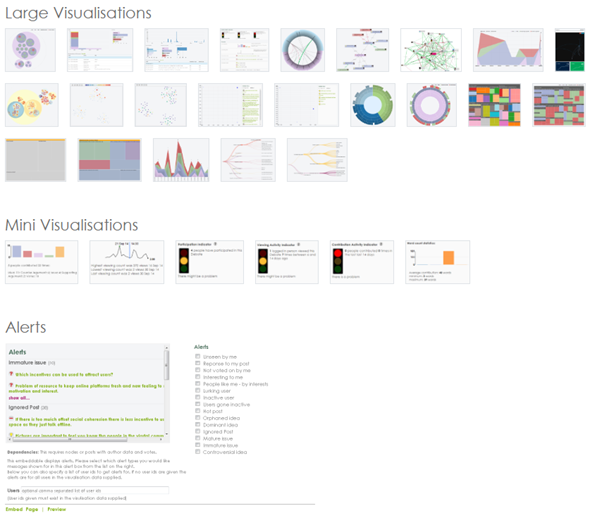
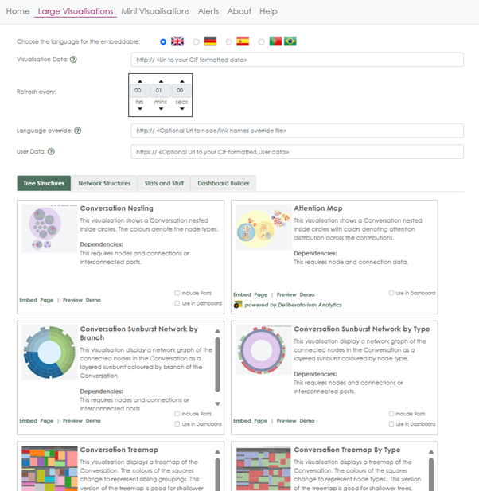
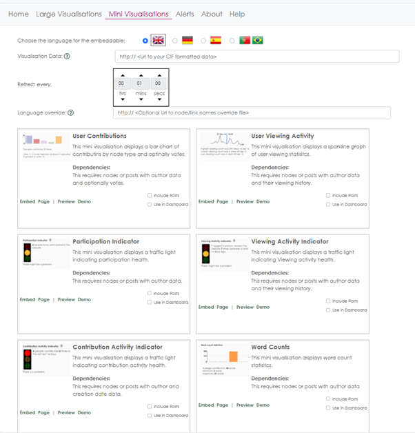
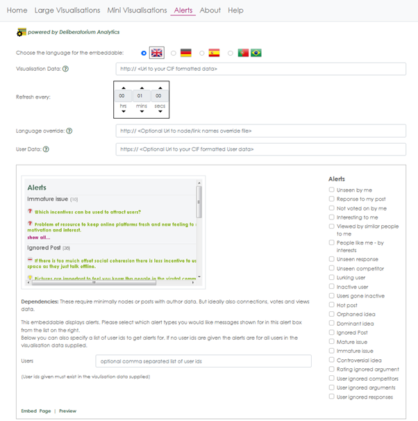

> **Important**  
> This code base was developed as part of research conducted at the Knowledge Media Institute at The Open University. This code base is no longer in active development. The majority of the code was originally developed between 2012 and 2015 with various updates and tweaks over the following years, so a lot of the code is old in style and development practices.

> **Warning**  
> Some of the documentation in the `docs` folder may be out of date.

## License

CIDashboard is Copyright (c) 2015-2025 The Open University.

This software is freely distributed in accordance with                      
the GNU Lesser General Public (LGPL) license, version 3 or later           
as published by the Free Software Foundation.                            
For details see LGPL: <http://www.fsf.org/licensing/licenses/lgpl.html>    
                and GPL: <http://www.fsf.org/licensing/licenses/gpl-3.0.html>

## Overview

The Collective Intelligence Dashboard (CIDashboard) is a place in which analytics on conversational and social dynamics can be made visible and fed back to the community for further awareness and reflection on the state and outcomes of a public debate.

The site allows you to choose individual visualisations or compilations of visualisations as a custom dashboard that can be embedded as an iframe or linked to as a full page from another platform.

## Installation

The `docs` folder has the CIDashboard documentation, which includes instructions for setting up a CIDashboard instance (`index.html`).

Start by opening `docs/index.html` and reading the notes.

## Screenshots

- **Overview of Visualisations from the hompage**  
  

- **Large Visualisations page**  
  

- **Mini Visualisations page**  
  

- **Alerts page**  
  

## Research

The CI Dashboard came from research on Contested Collective Intelligence carried out by the [IDea group](https://idea.kmi.open) from the Knowledge Media Institute.

Contested Collective Intelligence (CCI) is a specific form of CI that emerges through structured discourse and argumentation. Mostly facilitated by argumentation-based online discussion tools, CCI aims at supporting collective sensemaking of complex societal dilemmas and seeks to improve our collective capability to face complex problems by talking to each other and debating online.

One of the key issues shared by most common platforms for online debate is poor visualization. Online debate is still heavily dominated by text-based content, while most online users today prefer easy-to-understand image or video content that they can grasp rapidly and share easily with peers. Conveying results of online deliberation with effective visualization methods remains an open challenge.

*How would you visualize what happens in an online community? How can we make ideas and arguments more tangible so that they can be easily grasped, understood, and shared? How do we devise intuitive, engaging, interactive visualisations for users to better explore and understand the main content, insights, outcomes, and hidden dynamics of an online debate?*

The CIDashboard website was a research prototype aimed at answering those questions. It supported debate summarization, understanding, and sensemaking by providing a variety of alternative visualisations of the state, content, and results of an online discussion.

### Problems the dashboard aimed to address

- Participants struggle to get an overview of what happened in an online community debate (Who are the key members? What are the most relevant discussions?).  
- Participants are rarely aware of other people's contributions before they contribute to the debate (this can lead to poorly informed contributions and idea duplication).  
- Newcomers do not know where to start contributing.  
- Community managers do not know where new contributions would be mostly needed (debate management is ineffective without tools to analyse the debate and direct users' attention).  
- Community managers struggle to summarise the state of a debate to disseminate results and engage new users.

These issues informed the choice of visualisations, analytics, and alerts that CIDashboard provided.

## Tech info

The Collective Intelligence Dashboard was an analytics visualisation service provider for other online discussion and Collective Intelligence platform providers, such as:

- **Assembl** - a large scale co-production system  
- **DebateHub** - a hub for structured debates  
- **LiteMap** - a debate mapping tool

Communication between the analytics visualisation provider and the platforms was based on a standardised data format - the [Catalyst Interchange Format (CIF)](http://purl.org/catalyst/jsonldrms) of RDF and is serialised as JSON-LD. It provides a standardised description of online conversations. The CI Dashboard used the CIF data either directly to generate visualisations, or it requested CI statistics from the CATALYST metric service. That service calculated CI specific metrics from the CIF data and provided these to the CI Dashboard.

Below are some key CIF concepts extracted from the interoperability specification:

> Most Collective Intelligence tools allow organising concepts in some sort of structure that reflects the conversation back to the participants (a concept map in the very broadest sense). The core of this specification is a data model to represent the following in a systems-independent way while preserving as much semantics as practical:
>
> - The generic ideas of the concept map  
> - The people interacting with them  
> - The interactions these people have about the generic ideas (messages, comments, votes, etc.)

It goes on to say:

> The type and amount of structure can vary greatly between systems, but there are some useful levels of shared semantics that are achievable relatively easily. The first and most basic level is sharing the raw structure of the concept map (nodes, edges) with very basic information (such as node title). This allows several visualisation tools to be applied, as well as a significant number of metrics. The second level is to share more semantics about the nature of the concepts identified. The consortium agreed that using IBIS (Issue-Based Information System) as a common baseline would foster the emergence of initial tooling. While it has significant limitations, IBIS is a good choice because:
>
> - It is widely used by existing Collective Intelligence software  
> - Many systems not using IBIS could transform at least a subset of their data into meaningful IBIS

## Acknowledgments
CIDashboard’s design, development and testing was undertaken as part of the FP7 Project Catalyst on Collective Applied Intelligence and Analytics for Social Innovation  - by the Knowledge Media Institute team (Anna De Liddo, and Michelle Bachler) at the Open University. We are indebted to Harriett Cornish for graphic design.

## Repository

[Open Source code]( https://github.com/idea-kmi/CIDashboard)

## Status

Archived - no active development.
